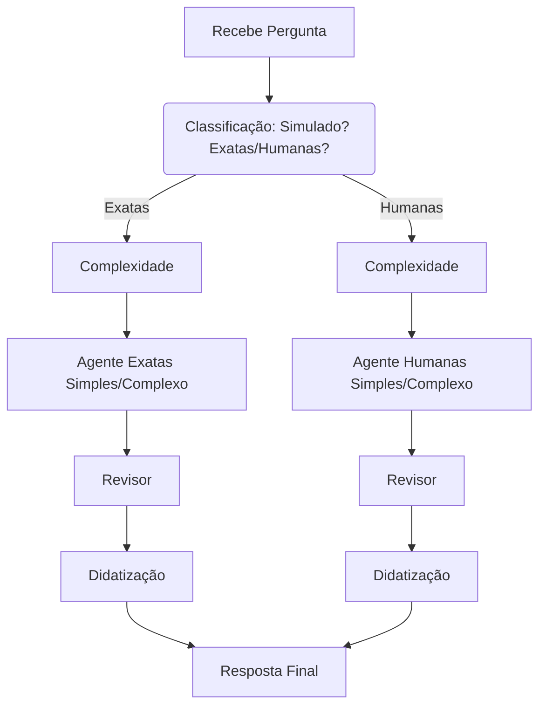

# Chatbot Universitário (EducAI)

Assistente educacional completo em **Python/Flask** preparado para ajudar estudantes brasileiros na preparação para **Vestibulares** e **ENEM**.  Inclui agentes especializados para classificar e **resolver questões** de *Exatas* e *Humanas* usando a **API Google Gemini**.

> **Status do Projeto:** em desenvolvimento ativo · contribuições bem‑vindas!

---

## ✨ Principais Funcionalidades

| Categoria                  | Descrição                                                                                        |
| -------------------------- | ------------------------------------------------------------------------------------------------ |
| **Contexto Dinâmico**      | Injeta data, hora, semana ISO e notícias em tempo real no prompt.                                |
| **Memória & Cache**        | Histórico das últimas 100 interações + cache de conteúdos (editais, dicas, etc.).                |
| **Interface Mobile‑First** | UI escura, responsiva e inspirada no estilo TikTok.                                              |
| **Agentes de Questões**    | Pipelines que classificam a área, avaliam complexidade, resolvem, revisam e didatizam respostas. |
| **Integração Flask**       | Endpoints REST + páginas HTML para chat e simulados.                                             |

---

## 🛠️ Tech Stack

* **Backend:** Python ≥ 3.12, Flask
* **IA:** Google Generative AI (Gemini)
* **UI:** Tailwind CSS
* **Cache e Config:** `cachetools`, `python‑dotenv`
* **Feeds RSS:** `feedparser`

---

## 🗂️ Estrutura do Repositório

```text
.
├── app.py                     # App Flask principal
├── templates/                 # Jinja2 HTML
├── static/                    # CSS, JS, imagens
├── utils/
│   ├── agents_exatas.py       # Pipeline e agentes de Exatas
│   ├── agents_humanas.py      # Pipeline e agentes de Humanas
│   ├── classifiers.py         # Funções de classificação
│   ├── cache.py               # Implementação de TTLCache
│   └── rss_to_md.py           # Conversor de RSS → Markdown
├── requirements.txt           # Dependências
├── .env.example               # Exemplo de variáveis de ambiente
└── README.md                  # Este arquivo
```

---

## 🚀 Instalação Rápida

```bash
# 1. Clone o repositório
$ git clone https://github.com/<seu‑usuario>/chatbot‑universitario.git
$ cd chatbot‑universitario

# 2. Crie e ative o ambiente virtual
$ python -m venv .venv
$ source .venv/bin/activate        # Linux/macOS
# .\.venv\Scripts\activate       # Windows

# 3. Instale as dependências
$ pip install -r requirements.txt

# 4. Copie o .env de exemplo e adicione sua chave Gemini
$ cp .env.example .env
$ echo "GOOGLE_API_KEY=SuaChaveAqui" >> .env
```

### 📡 Execução Local

```bash
flask run
```

Acesse `http://127.0.0.1:5000` no navegador.

### 🤖 Executar Agentes de Questões Diretamente

```bash
# Exatas
python utils/agents_exatas.py "Qual é a derivada de x²?"

# Humanas
python utils/agents_humanas.py "Explique as causas da Revolução Francesa."
```

---

## 🧩 Configurações Importantes

| Parâmetro                      | Local                 | Descrição                                     |
| ------------------------------ | --------------------- | --------------------------------------------- |
| `FAST_MODEL` / `HIGH_ACCURACY` | `config.py` ou `.env` | Modelos Gemini usados nas etapas do pipeline. |
| `CACHE_TTL`                    | `utils/cache.py`      | Duração em segundos do cache de conhecimento. |
| `RSS_FEED_URL`                 | `utils/rss_to_md.py`  | Fonte de notícias injetadas no contexto.      |

---

## 📑 API & Endpoints

| Rota                  | Método | Descrição                                  |
| --------------------- | ------ | ------------------------------------------ |
| `/`                   | `GET`  | Tela de boas‑vindas                        |
| `/inicio`             | `GET`  | Interface principal do chat                |
| `/perguntar`          | `POST` | Recebe pergunta → devolve resposta em HTML |
| `/adicionar_conteudo` | `POST` | Atualiza arquivos de conhecimento          |

---

## 🏗️ Como Funcionam os Agentes



Cada pipeline permite **até 3 tentativas** antes de retornar erro.

---

## 🤝 Contribuindo

1. **Fork** o projeto
2. Crie sua branch: `git checkout -b feature/minha‑feature`
3. Commit: `git commit -m "Minha feature"`
4. Push: `git push origin feature/minha‑feature`
5. Abra um **Pull Request**

Consulte `CONTRIBUTING.md` para diretrizes detalhadas.

---

## 📝 Licença

Distribuído sob a **MIT License**.  Veja `LICENSE` para detalhes.

---

## 👤 Autor

**Laredo Nunes** · GitHub: [@laredonunes](https://github.com/laredonunes)

> “Educação é a arma mais poderosa que você pode usar para mudar o mundo.” — Nelson Mandela
